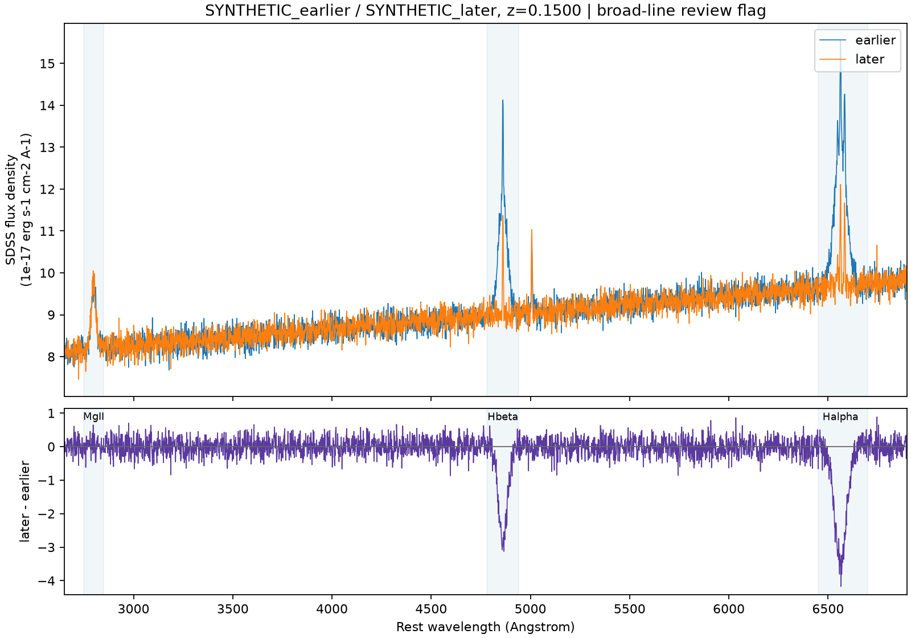

# Changing-Look AGN Detection

This project explores how repeat optical spectra can be used to find **changing-look AGN candidates**. It started with exploratory work in summer 2025 using repeat SDSS quasar observations. The code here is a new implementation built afterward: it reads SDSS spectra, measures selected emission lines in both epochs, fits simple broad Balmer components, and produces plots and review priorities. A review flag is a reason to inspect a pair, not a confirmed changing-look classification.

## Try it without downloading survey data

Python 3.10 or later is required.

```bash
python -m venv .venv
source .venv/bin/activate
python -m pip install -e '.[test]'
clagn demo --out-dir results/demo
pytest -q
```

The demo writes two **synthetic** SDSS-shaped FITS spectra on slightly different wavelength grids, a JSON measurement record, and a diagnostic PNG. The injected broad Hβ and Hα components disappear between epochs. These files are generated examples, not observed objects or discoveries.



## Compare your own SDSS spectra

```bash
clagn compare data/spec-earlier.fits data/spec-later.fits \
  --z 0.15 --out-json results/pair.json --plot results/pair.png
```

Pass the same object's two individual SDSS `spec-PLATE-MJD-FIBER.fits` files and a checked catalog redshift. The earlier/later order matters for the sign of changes. No resampling is required for the numerical line measurements: each epoch is integrated on its own observed-wavelength grid. Interpolation is used only for the difference *plot*, with masked gaps left blank.

The JSON includes locally continuum-subtracted integrated Hβ, Hα, Mg II, and [O III] measurements where covered; formal errors and rest-frame equivalent widths; exploratory broad Hβ/Hα fits; a review flag; and a priority score. Hα's simple integrated window includes [N II]. The priority score is the maximum absolute formal change significance among measured broad-line windows and qualifying fitted-component changes; it has **no validated probability or classification threshold**. The broad-transition flag uses heuristic fit criteria and must be inspected.

## Work through a DR16Q subset

Download [`DR16Q_v4.fits` from SDSS](https://www.sdss4.org/dr17/algorithms/qso_catalog/) into `data/` (about 1.7 GB). Install the optional downloader:

```bash
python -m pip install -e '.[sdss,test]'
clagn select-pairs data/DR16Q_v4.fits --max-z 0.8 --limit 10 --out results/pairs.csv
clagn fetch results/pairs.csv --cache-dir data/spectra --log results/fetch-log.csv
clagn analyze results/pairs.csv --cache-dir data/spectra \
  --out results/ranking.csv --details-dir results/details --plots-dir results/plots
```

Selection takes the oldest and latest valid primary/duplicate plate–MJD–fiber observations for each quasar with `0 < Z < 0.8` and `NSPEC >= 1`. This reproduces the *direction* of the 2025 notes, not their unverified counts or results. Start with a small `--limit`: survey downloads may be slow or unavailable. The manifest records rest-frame time separation; the fetch log records release, retrieval time, SHA-256, and failures. The cache and outputs are ignored by Git.

`fetch` defaults to SDSS data release 17 through `astroquery`; pass `--release` explicitly if using a different compatible archive. Analyzed rows that fail are recorded with errors, and a nonzero exit status signals failures. Raw survey spectra and catalogs are not redistributed here. See [data and provenance](docs/DATA.md).

## Scope and status

| Part | Status |
| --- | --- |
| Repeat-observation selection, local spectral measurements, plots, and synthetic checks | Implemented now |
| Survey-wide run, manual candidate review, calibrated selection thresholds, completeness/contamination | Not established |
| Changing-look confirmations, mechanisms, universal line finding | Not claimed |

The summer 2025 notes describe an exploratory area under a two-epoch flux difference and a trial value of 1000 near Hβ. Its units and performance were not validated, so this code does not treat it as a classifier. Line changes may reflect calibration, aperture, sky subtraction, noise, continuum and host changes, or true source variability. Changing obscuration and changing accretion state require additional evidence; broad-line fit changes alone do not decide between them. See [methods](docs/METHODS.md), [history](docs/HISTORY.md), and the [validation plan](docs/VALIDATION.md). The expanded report is public as both [TeX source](report/main.tex) and a [PDF with figures and references](report/main.pdf).

## References and reuse

The line windows were adapted from [Guo et al. (2024)](https://doi.org/10.3847/1538-4365/ad118a); the [SDSS DR16Q catalog](https://www.sdss4.org/dr17/algorithms/qso_catalog/) and its [data model](https://data.sdss.org/datamodel/files/BOSS_QSO/DR16Q/DR16Q_v4.html) document the input. [Ricci & Trakhtenbrot (2023)](https://doi.org/10.1038/s41550-023-02108-4) review changing-look AGNs. Cite the survey and source papers when using their data or methods. Project code is covered by the existing MIT license; SDSS data retain their own terms.
